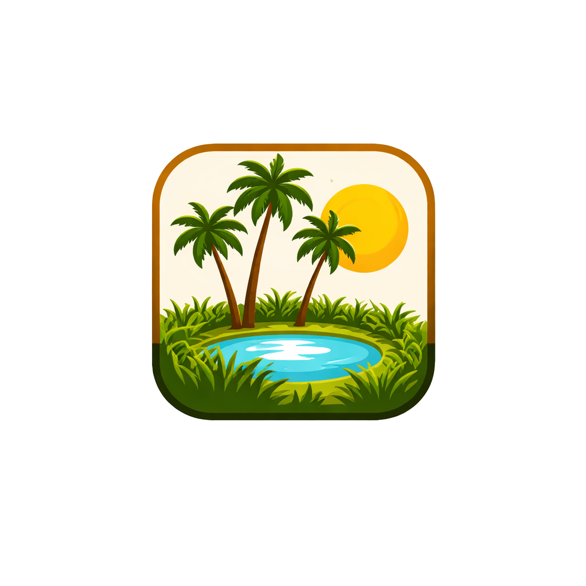

<div align="center">
  
  <h1>Oasis</h1>
  <p><strong>A premium desktop application for browsing and downloading Sites locally.</strong></p>
  
  <p>
    <a href="#features">Features</a> •
    <a href="#installation">Installation</a> •
    <a href="#usage">Usage</a> •
    <a href="CONTRIBUTING.md">Contributing</a>
  </p>
</div>

---

## 🌊 What is Oasis?

**Oasis** is a modern desktop application built with **Electrobun** that allows you to browse and download entire Sites (as `.zim` files) for offline access. Whether you're in a low-connectivity area or simply want to have your favorite resources available anytime, Oasis provides a seamless and beautiful experience for managing your local library.

## ✨ Features

- **🚀 Built with Electrobun**: Lightweight and fast, leveraging the power of Bun for a superior desktop experience.
- **📚 Browse & Download**: Easily find and download Sites in the `.zim` format.
- **🖼️ Beautiful UI**: A clean, modern interface built with **React** and **Tailwind CSS**.
- **⚡ Fast Search**: Quickly find what you need within your local library.
- **📦 Workspace Architecture**: Organized as a monorepo using **Turbo** for efficient development and builds.
- **💾 Local Storage**: Your data stays on your machine, ensuring privacy and offline availability.

## 🛠️ Built With

- [Electrobun](https://electrobun.dev/) - Revolutionary desktop app framework.
- [React](https://reactjs.org/) - Frontend library for building user interfaces.
- [Bun](https://bun.sh/) - Fast all-in-one JavaScript runtime.
- [Tailwind CSS](https://tailwindcss.com/) - Utility-first CSS framework.
- [Drizzle ORM](https://orm.drizzle.team/) - TypeScript ORM for SQL databases.
- [Turbo](https://turbo.build/) - High-performance build system.

## 🚀 Getting Started

### Prerequisites

- [Bun](https://bun.sh/) installed.

### Installation

1. Clone the repository:

   ```bash
   git clone https://github.com/alhaymex/oasis.git
   cd oasis
   ```

2. Install dependencies:
   ```bash
   bun install
   ```

### Running the App

To start the development server:

```bash
bun run dev:hmr
```

## 🤝 Contributing

Contributions are what make the open-source community such an amazing place to learn, inspire, and create. Any contributions you make are **greatly appreciated**.

Please see [CONTRIBUTING.md](CONTRIBUTING.md) for details on our code of conduct and the process for submitting pull requests.

## 📄 License

Distributed under the MIT License. See `LICENSE` for more information.

## Desktop Packaging Notes

The desktop app now ships with a bundled local catalog and bundled SQLite migrations.

- Canonical catalog source: `catalog/catalog.json`
- Desktop-local staged copy used by dev/build: `apps/desktop/.generated/catalog/catalog.json`
- `Resources/app/catalog/catalog.json`
- `Resources/app/drizzle/*`

Notes:

- You do not need to manually copy the catalog into `apps/desktop`. Desktop scripts stage it automatically before `dev`, `start`, `build:canary`, and `build:stable`.
- On first launch, Oasis runs DB migrations, seeds the bundled catalog into SQLite, and only then opens the main window.
- The installed app must not depend on the monorepo root at runtime. Files needed after packaging must be copied into desktop resources during build.

---

<p align="center">Made with ❤️ for the offline web.</p>
